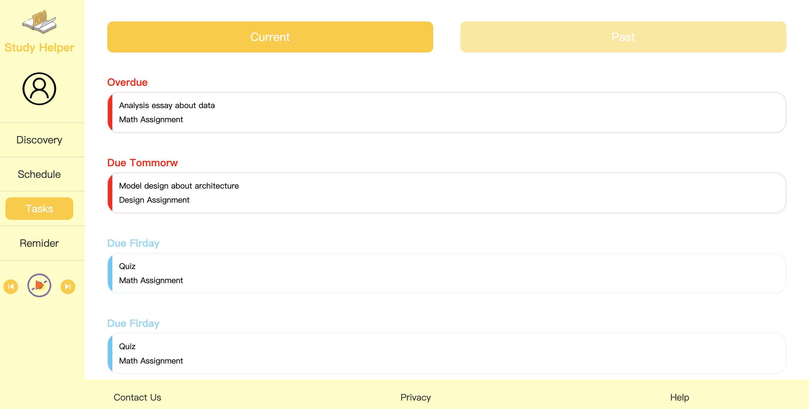

# StudyHelper
## About StudyHelper

Due to the Covid-19, students have to start learning online. However, this new learning mode makes many students feel uncomfortable, and they cannot plan their study schedule and time well. StudyHelper is a Web app that allows students to plan courses and schedule assignments to help them study more efficiently.

## Final screen shots & Method of use
### Login Page

This is the login page of StudyHelper. Users can enter the email and password to login.(Tutors can enter any email address and password to log in when you check my A3)

### Discovery Page

This is the resources page of StudyHelper. Users can find the resources they need in the search box

### Schedule Page

This is the schedule page of StudyHelper. Users can add classes and assignments arrangements here

Users can set the name and time of classes here

### Tasks Page 

This is the tasks page of StudyHelper. The Tasks page is used to remind consumers of job deadlines 

### Reminder Page

Users can use this page to count down while they are studying. The study mode is a timer, starting at 0. In Longbreak mode, the countdown timer is 60 minutes. The ICONS in the lower left corner are the Start and pause buttons, and the ICONS in the lower right corner are the Reset button. 

### Musicplayer

This is the music player. Users can use it for relaxing. The middle icon is the music pause or play key, left and right to cut the song key.

# Iteration

I have changed the overall layout of the page and the layout of the Reminder feature to make it easier for users to understand. In addition, I also added the ability to set up courses and assignments. Below is a comparison of initial and final Mockup

### Discovery Page

 The changed discovery page looks cleaner

### Schedule Page

 The changed schedule page's function is more detailed

### Reminder Page

 The changed reminder page is easier to understand 

### Musicplayer

The changed musicplayer is easier to find and use which is at the end of the feature bar.

